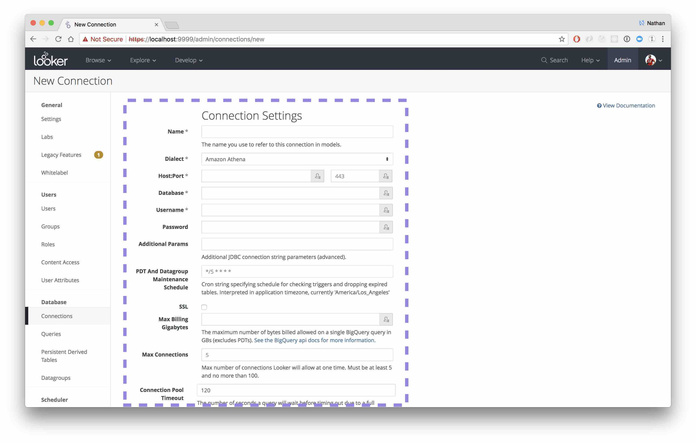

One of Lens' core tenets is that adoption determines its success. Helltool is Looker's biggest project, so to meet Lens' adoption goal it must provide methods to interface with and be consumed by Helltool's existing code base.

## Requiring Components

Lens components are written in Typescript and published as ES6-compatible modules. They can be required into other ES6 modules using the typical ES6 `import / export` syntax:

```jsx static
import { Button } from 'looker-lens'

const MyComponent = () => {
  return (
    <div>
      <span>Here's a button</span>
      <Button onClick={}>Click me</Button>
    </div>
  )
}
```

## Using Lens Components in Helltool's Angular App

Lens aims to make its components as portable as possible. That means Lens components should be able to be used anywhere and behave in an expected way. Unfortunately, Angular expresses its components as a string template, which is not compatible with React's function based approach.

Bridging the two is fairly straightforward. To ensure Lens components are available in Angular, Helltool contains a helper called the [Lens Bridge](https://github.com/looker/helltool/blob/master/lib/helltool/assets/lens/lens_bridge.tsx). The Bridge registers a Lens (or any React) component with Angular and generates an Angular component, including a compatible component interface, that can be used in the Angular side of Helltool to communicate with an underlying Lens or React component.

> `Lens (React) <<|Lens Bridge|>> Helltool Angular`
>
> Conceptually, the Lens Bridge creates a connection between one Lens or React component and an Angular application.

## Registering a Lens Component with the Lens Bridge

Imagine we want to replace a simple button in Angular with a Lens button. We can do that using the Lens Bridge. First we need to register the Lens Button component with the Bridge and give it a name:

```jsx static
import { Button } from 'looker-lens'
import { register } from '../lens_bridge'

register('Button', Button, [
  'color',
  'size',
  'disabled',
  'variant',
  'onClick',
  'type',
])
```

The `register` function takes a string name, the Lens or React component instance and a list of the Lens interface properties we want to expose to Angular. Each property is bound with a [one-way Angular data binding](https://docs.angularjs.org/api/ng/service/$compile#-scope-), mimicking React's behavior.

`register` names the Angular component the value of the first argument, prefixed with `lens-`. This means that Button becomes `lens-button` in Angular templates.

One of Angular's greatest frustrations is its piling on of conventions, so why add yet another through the `lens-` prefix convention? The intent is to make it very clear where the breakpoints are between Lens code and Angular code throughout Helltool's code base.

## Using the Wrapped Lens Component

Now that the Button component has been registered with the Lens Bridge we can use it in Angular easily.

First, we need to tell our Angular Module that it depends on the Lens Bridge Angular Module:

```typescript static
import { lensBridgeAngularModule } from '../lens_bridge'

const m = angular.module('looker.admin.themes', [lensBridgeAngularModule.name])
```

Now, anywhere in our `looker.admin.themes` Angular module we can use the registered Lens components:

```typescript static
const componentTemplate = `
  <div>
    <lens-button color='"danger"' on-click='$ctrl.clickHandler'/>
  </div>
`
```

> ⚠️ A note on Angular's one-way data binding ⚠️
>
> In the example above note that `danger` appears to be quoted twice as in `color='"danger"'`. That's because Angular will parse and interpret the value of any attribute designated as a one-way data binding as Javascript. If `danger` was not quoted in double quotes, Angular would treat it as a variable named `danger`, not the string `danger`. Most of the time you won't be passing string values, you would pass references to a controller property, as you can see with the on-click handler.

### What Belongs on the Lens Side of the Bridge?

The example above describes registering a single Lens Button component with the Lens Bridge and using it in Angular. While this will work, decomposing every Angular component to its constituent Lens component is tedious and less expressive than using Lens components in a React context.

It's suggested that developers try to find small to medium sized chunks of UI to express via Lens and put those entire chunks behind the Lens Bridge.

For example, write a whole form in Lens and put that behind the Bridge, instead of putting each button and input in a form behind the Bridge. Let's look at a quick example of how we might apply this to the Admin Connection form.

### Example: Using Lens in the Admin Connection Form

> ⚠️ Heads up ⚠️
>
> This is a contrived example and does not reflect actual code in Helltool. The intent is to describe a reasonable workflow when integrating Lens into an existing Helltool UI.

The Admin Connection page displays a relatively simple form which allows admins to configure new database connections:


Using the Bridge, we can define the scope of work as the entire form, encode it as a new component composed of Lens components, and put it behind the Bridge:



### Deciding on an Interface

Before starting on the Lens powered version of the Connection form, we should decide on the form component's interface. It likely receives an object that describes a current connection if the user is editing a connection, or null if the user is creating a new connection. Let's assume that it saving and testing the connection is a complex process already well defined in Helltool's Angular code. Instead of immediately porting that to a Lens / React environment we can reuse the logic by passing handlers across the Bridge and into our form component.

So we need:

1. A way to receive a Connection object
1. A save handler function
1. A test connection handler function

### Building the Connection Form Component

To build the Lens powered version of the form, we can start by defining a React component in Helltool. Let's call the file `admin_connection_form.tsx`. Its contents might look something like so (some parts of this example are abbreviated for the sake of instruction):

```jsx static
import React, { Component} from 'react'
import {
  Button,
  FieldText,
} from 'looker-lens'

interface ResultMessage {
  error: boolean
  message: string
  level: 'info' | 'error' | 'warn'
}

interface AdminConnectionFormProps {
  connection: Connection
  onSave: (connection: Connection) => ResultMessage
  onTest: (connection: Connection) => ResultMessage
}

export class AdminConnectionForm extends Component<AdminConnectionFormProps> {
  render () {
    return <Form>
      <FieldText label='name' name='name' hint='The name you use to refer to this connection in models.' />
      ...
      <Button onClick={this.props.onSave}>Add Connection</Button>
      <Button variant='outline' onClick={this.props.onTest>Test These Settings</Button>
    </Form>
  }
}
```

Next we'll ensure we register the `AdminConnectionForm` component with the Lens Bridge:

```typescript static
// presumably in the same admin_connection_form.tsx file:
import { register } from '../lens_bridge'

register('AdminConnectionForm', AdminConnectionForm, [
  'connection',
  'onSave',
  'onTest',
])
```

And register the lensBridgeAngularModule as a dependency of the Admin Connection Angular module:

```typescript static
import { lensBridgeAngularModule } from '../lens_bridge'

const m = angular.module('looker.admin.connections', [
  adminNavModule.name,
  lensBridgeAngularModule.name,
  lookerControllerModule.name,
  mainNavModule.name,
])
```

Finally the new AdminConnectionForm component can be referenced in Angular like so:

```typescript static

// Note this is a convention, but is needed to ensure we include the admin_connection_form at least once,
// so it is registered with the Lens Bridge. Doing the import here, where the underling AdminConnectionForm component
// is used brings the dependency together a bit better.
export { AdminConnectionForm } from './admin_connection_form.tsx'

class AngularAdminConnectionForm extends angular.IController {
  connection: Connection
  saveHandler (connection: Connection) { ... }
  testHandler (connection: Connection) { ... }
}

adminConnectionModule.component({
  controller: AngularAdminConnectionForm,
  template: `
    <lens-admin-connection-form connection='$ctrl.connection' on-save='$ctrl.saveHandler' on-test='$ctrl.testHandler'/>
  `
})
```

## Lens Bridge Gotchas

- The Lens Bridge does not support composition through Angular's concept of transclusion. This means Angular template code like this is invalid:

  ```typescript  static
  <lens-button>
    <lens-icon-file />
  </lens-button>
  ```

  Instead, perform that composition within Lens components on the React side of the Bridge. Unfortunately, given Angular's string based templates, it's not possible to programattically enforce this with a typechecker (note this _is_ enforceable in React).

- Lens Bridge produces an Angular component using only one-way bindings.

- After registering a component with Lens, you must include the lensBridgeAngularModule as a dependency to your Angular module, otherwise the newly registered Lens component will appear to not exist.
